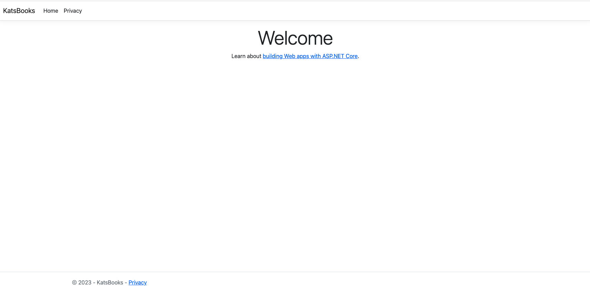

# Introduction to .NET Framework 

This project is part Udemy by Bhrugen Patel and following along with Microsoft Documentation. 

**Udemy Course:** 

Build real world e-commerce application using ASP.NET Core MVC, Entity Framework Core and ASP.NET Core Identity.

**Microsoft documentation**

* https://dotnet.microsoft.com/en-us/learn/dotnet/hello-world-tutorial/intro
* https://learn.microsoft.com/en-gb/aspnet/core/?view=aspnetcore-7.0

_________________________________

## Getting Started

``dotnet build``

``dotnet run``

_________________________________

## Packages

* .NET Framework: .NET 7

_________________________________

##  Screenshots 

